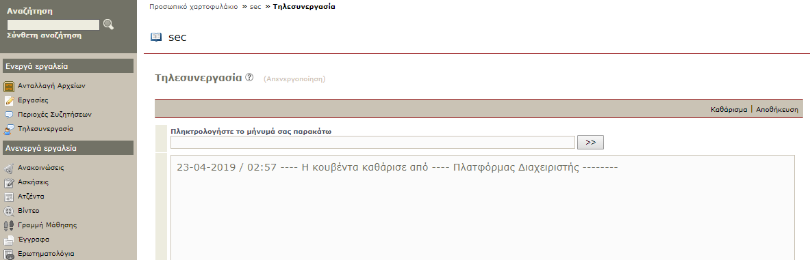
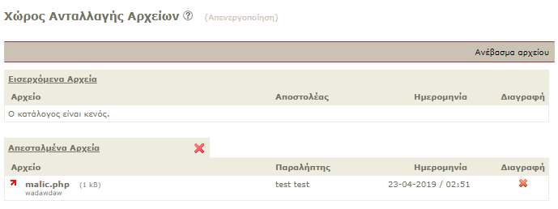
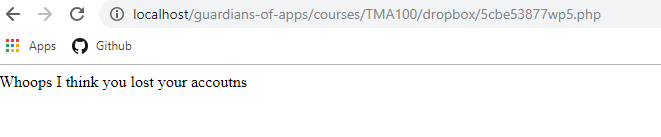
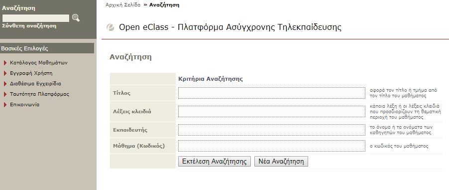

# guardians-of-apps

## Potential threats


* [index.php](index.php) ```login form, search form ```
* [newuser.php](modules/auth/newuser.php) ```new user form```
* [newprof.php](modules/auth/newprof.php) ```new profile form```
* [lostpass.php](modules/auth/lostpass.php) ```new password form```
* [profile.php](modules/profile/profile.php) ```update profile form```
* [index.php(dropbox)](modules/dropbox/index.php) ```file exchange```
* [work.php](modules/work/work.php) ```assignment submit form```
* [newtopic.php](modules/phpbb/newtopic.php) ```new subject form```
* [conference.php](modules/conference/conference.php) ```e-cooperation```


## Vulnerabilities
* #### Τηλεσυνεργασία
  
  * Vulnerability 
  * Defence
  
  
* #### Ανταλλαγή αρχείων 
  * Vulnerability 
  * Defence
  

* #### Αναζήτηση
  * Vulnerability 
  * Defence

## Τηλεσυνεργασία 

### Vulnerability
  [conference.php](modules/conference/conference.php) ```e-cooperation```
  
  
  
  
  
  This part of the application is vulnerable to XSS attacks as it doesn't have special characters escape.
  [conference.php](modules/conference/conference.php) redirects to [messageList.php](modules/conference/messageList.php)
  with this form 
  ```
  <form name='chatForm' action='messageList.php' method='get' target='messageList' onSubmit='return prepare_message();'>
    <table width='99%' class='FormData'>
    <thead>
    <tr>
      <th>&nbsp;</th>
      <td>
  
        <b>$langTypeMessage</b><br />
        <input type='text' name='msg' size='80'style='border: 1px solid #CAC3B5; background: #fbfbfb;'>
        <input type='hidden' name='chatLine'>
        <input type='submit' value=' >> '>
  
      </td>
    </tr>
    <tr>
      <th>&nbsp;</th>
      <td><iframe frameborder='0' src='messageList.php' width='100%' height='300' name='messageList' style='background: #fbfbfb; border: 1px solid #CAC3B5;'><a href='messageList.php'>Message list</a></iframe></td>
    </tr>
    </thead>
    </table>
  </form>
  ```
  
  Then it uses a writer to keep the data from the chat 
  
  ```
  // add new line
  if (isset($chatLine) and trim($chatLine) != '') {
  	$fchat = fopen($fileChatName,'a');
  	$chatLine = mathfilter($chatLine, 12, '../../courses/mathimg/');
  	fwrite($fchat,$timeNow.' - '.$nick.' : '.stripslashes($chatLine)."\n");
  	fclose($fchat);
  }
  ```
  
  In this case malicious users can XSS attack using a script.
  
### Defence
  
  We can use htmlspecialchars to prevent malicious scripts being saved as data.
  
  ```
  // add new line
  if (isset($chatLine) and trim($chatLine) != '') {
  	$fchat = fopen($fileChatName,'a');
  	$chatLine = mathfilter($chatLine, 12, '../../courses/mathimg/');
  	// Added htmlspecialchars to prevent malicious user to do xss attack on chat
  	fwrite($fchat,$timeNow.' - '.$nick.' : '.stripslashes(htmlspecialchars($chatLine, ENT_QUOTES, 'UTF-8'))."\n");
  	fclose($fchat);
  }
  ```
  
## Ανταλλαγή αρχείων 
  
### Vulnerability

  [index.php(dropbox)](modules/dropbox/index.php) ```file exchange```
  
  A malicious user can upload a file in this php page.
  
     
  If the malicious user finds the path to the uploaded file he can run whatever he wants from the inside
  of our server.
  
  
  [index.php(dropbox)](modules/dropbox/index.php) redirects to [dropbox_submit.php](modules/dropbox/dropbox_submit.php)
  with this form: 
  ```
  <form method="post" action="dropbox_submit.php" enctype="multipart/form-data" onsubmit="return checkForm(this)">
  tCont2;
  	$tool_content .= "
      <table width='99%' class='FormData'>
      <tbody>
      <tr>
        <th class='left' width='220'>&nbsp;</th>
        <td><b>".$dropbox_lang["uploadFile"]."</b></td>
      </tr>
      <tr>
        <th class='left'>".$dropbox_lang['file']." :</th>
        <td><input type='file' name='file' size='35' />
            <input type='hidden' name='dropbox_unid' value='$dropbox_unid' />
        </td>
   ...
   ...
   ```
   
   Then it uses this code to set the name of the file:
   ```
   $dropbox_title = $dropbox_filename;
   $format = get_file_extension($dropbox_filename);
   $dropbox_filename = safe_filename($format);
   // Transform any .php file in .phps fo security
   // $dropbox_filename = php2phps ($dropbox_filename);
   ```
   
   ### Defence
   
   We can check the file's extension and if the file is php or html type then we add an "s" to the extension
   (htmls, phps) so the malicious user cannot run php or a script inside our server.
   
   ```
   $dropbox_title = $dropbox_filename;
   $format = get_file_extension($dropbox_filename);
   $dropbox_filename = safe_filename($format);
   // saves the file extension
   $file_type = pathinfo($dropbox_filename, PATHINFO_EXTENSION);
   // if file is php or html changes extension to phps or htmls
   if ($file_type == 'php' || $file_type == 'html') {
       $dropbox_filename = substr_replace($dropbox_filename, $dropbox_filename . 's', $file_type);
   }
   ```

## Αναζήτηση

### Vulnerability
   [search_incourse.php](modules/search/search_incourse.php)
   
   [search_loggedin.php](modules/search/search_loggedin.php)
   
   [search_loggedout.php](modules/search/search_loggedout.php)
   
   A malicious user can do a CSRF attack by making a user submit a form with malicious' values. 
   
   
   
   
   
   <b>The code before improvements</b>:
   
   
   [search_incourse.php](modules/search/search_incourse.php) line 84
   
   ```
   /**********************************************************************************************
   	ektelesh anazhthshs afou yparxoun oroi anazhthshs
   	 emfanish arikown mhnymatwn anazhthshs
   ***********************************************************************************************/
   	//ektypwsh syndesmou gia nea anazhthsh
   	$tool_content .= "
       <div id=\"operations_container\">
         <ul id=\"opslist\">
           <li><a href=\"search_incourse.php\">$langNewSearch</a></li>
         </ul>
       </div>
       ";
   	$tool_content .= "
       <table width=\"99%\" class=\"FormData\" align=\"left\">
       <tbody>
       <tr>
         <th width=\"180\" class=\"left\">&nbsp;</th>
         <td><b>$langResults</b></td>
         ...
         ...
   ```


    
   [search_loggedin.php](modules/search/search_loggedin.php) line 87
    
   ```
   /**********************************************************************************************
   	ektelesh anazhthshs afou yparxoun oroi anazhthshs
   	 emfanish arikown mhnymatwn anazhthshs
   ***********************************************************************************************/
   	//ektelesh erwthmatos gia to se poia mathimata einai eggegramenos o xrhsths. sta apotelesmata perilamvanontai
   	//kai ola ta anoixta kai anoixta me eggrafh mathimata.
   	$result = mysql_query("SELECT DISTINCT * FROM (
   		SELECT  cours.code, cours.intitule, cours.course_keywords, cours.titulaires
   		FROM cours, cours_user  WHERE cours.cours_id = cours_user.cours_id AND cours_user.user_id = $uid
   		UNION
   		SELECT  cours.code, cours.intitule, cours.course_keywords, cours.titulaires
   		FROM cours
   		WHERE cours.visible IN ('1','2')
   		...
   		...
   ```
   
   [search_loggedout.php](modules/search/search_loggedout.php) line 82
   
   ```
   /**********************************************************************************************
   		ektelesh anazhthshs afou yparxoun oroi anazhthshs
   		 emfanish arikown mhnymatwn anazhthshs
   ***********************************************************************************************/
   	//to pedio visible exei times 2 kai 1 gia Public kai Open mathimata
   	$result = mysql_query("SELECT * FROM cours WHERE visible='2' OR visible='1'");
   	$results_found = 0; //arithmos apotelesmatwn pou exoun emfanistei (ena gia kathe grammh tou $mycours)
   	//*****************************************************************************************************
   	//vrogxos gia na diatreksoume ola ta mathimata sta opoia enai anoixta (public OR open for registration)
   	$tool_content .= "
       <div id=\"operations_container\">
         <ul id=\"opslist\">
           <li><a href=\"search.php\">$langNewSearch</a></li>
         </ul>
       </div>
       ...
       ...
   ```
   
   ### Defense 
   
   We created a token generator at the start of the session and each time a user tries to submit a
   form the server checks if the token is valid. If not it redirects the user to the loggin page.
   
   [index.php](index.php) line 36
   
   ```
   /***************************************************************
    *               Generates a token for CSRF prevention		               *
    ****************************************************************
    */
   
   session_start();
   $length = 32;
   $_SESSION['token'] = substr(base_convert(sha1(uniqid(mt_rand())), 16, 36), 0, $length);
   ```
   
   [search_incourse.php](modules/search/search_incourse.php)-[search_loggedin.php](modules/search/search_loggedin.php)-[search_loggedout.php](modules/search/search_loggedout.php)

   ```
   $tok = $_SESSION['token'];
   ```
   We create the $tok with the value of the token
   
   ```
   <input type=\"hidden\"  name=\"token\" value=\"$tok\">
   ```
   
   Then we add a hidden input in the form and pass the token as value
   
   ```
   /**********************************************************************************************
   	ektelesh anazhthshs afou yparxoun oroi anazhthshs
   	 emfanish arikown mhnymatwn anazhthshs
   ***********************************************************************************************/
   	// Validate token before submitting
   	if ($_SESSION['token']!=$_POST['token'] && $_POST['token'] != null) {
   		?>
   	<script type="text/javascript">
   		window.location.href = 'http://guardiansofapps.csec.gr/index.php?logout=yes';
   	</script>
   	<?php
   	}
   ```
   
   Finally we validate the token. If the post token is not the same as the session token and the 
   post has been made, the server redirects the user and logs him out.
   
## Εγγραφή 

### Vulnerability
    
  in the files [newprof.php](modules/auth/newprof.php) and [newuser.php](modules/auth/newuser.php)

  The code had vulnerabilities for XSS attacks as it would let a registration of a user with a script
  in his information.
  
  
  [newprof.php](modules/auth/newprof.php) line 143
  ```
 db_query('INSERT INTO prof_request SET	            
                                profname = ' . autoquote($prenom_form). ',	       
                                profsurname = ' . autoquote($nom_form). ',	                               
                                profuname = ' . autoquote($uname). ',	                                
                                profemail = ' . autoquote($email_form). ',	                               
                                proftmima = ' . autoquote($department). ',	
                                profcomm = ' . autoquote($userphone). ',
                                status = 1,	                              
                                statut = 1,	                                
                                date_open = NOW(),	                                
                                comment = ' . autoquote($usercomment). ',	                          
                                lang = ' . autoquote($proflang),	                               
                     $mysqlMainDb);
   ```
   
   
  [newuser.php](modules/auth/newuser.php) line 200
  
  ```
  $q1 = "INSERT INTO `$mysqlMainDb`.user		
  	(user_id, nom, prenom, username, password, email, statut, department, am, registered_at, expires_at, lang)
  	VALUES ('NULL', '$nom_form', '$prenom_form', '$uname', '$password_encrypted', '$email','5',	
  		'$department','$am',".$registered_at.",".$expires_at.",'$lang')";
  	$inscr_user = mysql_query($q1);		
  	$last_id = mysql_insert_id();
 ```
 
### Defense

We used html escape special characters.

[newprof.php](modules/auth/newprof.php) 

```
// Escape special chars
            $prenom_form_val = htmlspecialchars($prenom_form, ENT_QUOTES, 'UTF-8');
            $nom_form_val = htmlspecialchars($nom_form, ENT_QUOTES, 'UTF-8');
            $uname_val = htmlspecialchars($uname, ENT_QUOTES, 'UTF-8');
            $department_val = htmlspecialchars($department, ENT_QUOTES, 'UTF-8');
            $userphone_val = htmlspecialchars($userphone, ENT_QUOTES, 'UTF-8');
            $usercomment_val = htmlspecialchars($usercomment, ENT_QUOTES, 'UTF-8');
            db_query('INSERT INTO prof_request SET
                                profname = ' . autoquote($prenom_form). ',
                                profsurname = ' . autoquote($nom_form). ',
                                profuname = ' . autoquote($uname). ',
                                profname = ' . autoquote($prenom_form_val). ',
                                profsurname = ' . autoquote($nom_form_val). ',
                                profuname = ' . autoquote($uname_val). ',
                                profemail = ' . autoquote($email_form). ',
                                proftmima = ' . autoquote($department). ',
                                profcomm = ' . autoquote($userphone). ',
                                proftmima = ' . autoquote($department_val). ',
                                profcomm = ' . autoquote($userphone_val). ',
                                status = 1,
                                statut = 1,
                                date_open = NOW(),
                                comment = ' . autoquote($usercomment). ',
                                comment = ' . autoquote($usercomment_val). ',
                                lang = ' . autoquote($proflang),
                     $mysqlMainDb);
```
[newuser.php](modules/auth/newuser.php) 

```
//Escaping special chars
	$uname_val = htmlspecialchars($uname, ENT_QUOTES, 'UTF-8');
	$nom_form_val = htmlspecialchars($nom_form, ENT_QUOTES, 'UTF-8');
	$prenom_form_val = htmlspecialchars($prenom_form, ENT_QUOTES, 'UTF-8');
	$department_val = htmlspecialchars($department, ENT_QUOTES, 'UTF-8');
	$am_val = htmlspecialchars($am, ENT_QUOTES, 'UTF-8');
	$q1 = "INSERT INTO `$mysqlMainDb`.user
	(user_id, nom, prenom, username, password, email, statut, department, am, registered_at, expires_at, lang)
	VALUES ('NULL', '$nom_form', '$prenom_form', '$uname', '$password_encrypted', '$email','5',
	VALUES ('NULL', '$nom_form_val', '$prenom_form_val', '$uname', '$password_encrypted', '$email','5',
		'$department','$am',".$registered_at.",".$expires_at.",'$lang')";
	$inscr_user = mysql_query($q1);
	$last_id = mysql_insert_id();
```